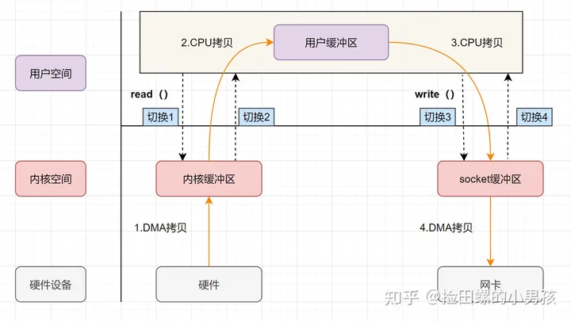
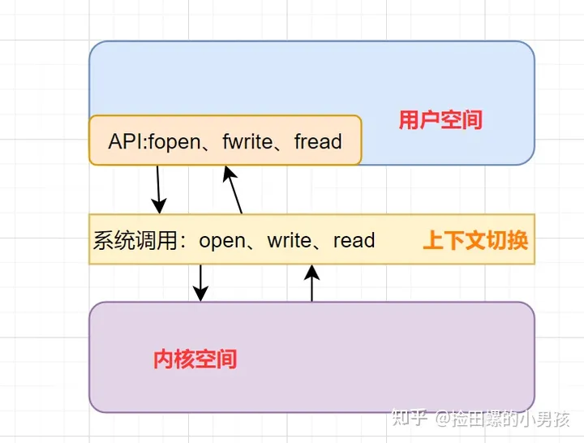
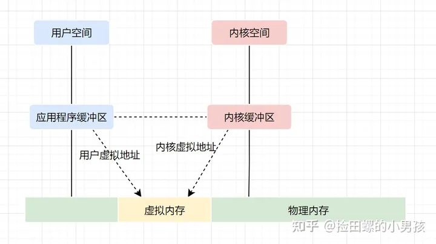
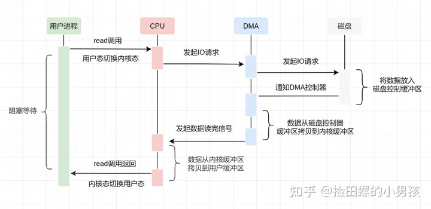

# 相关
## **1.什么是零拷贝**

零拷贝字面上的意思包括两个，“零”和“拷贝”：

- “拷贝”：就是指数据从一个存储区域转移到另一个存储区域。
- “零” ：表示次数为0，它表示拷贝数据的次数为0。

合起来，那**零拷贝**就是不需要将数据从一个存储区域复制到另一个存储区域咯。

> 零拷贝是指计算机执行IO操作时，CPU不需要将数据从一个存储区域复制到另一个存储区域，从而可以减少上下文切换以及CPU的拷贝时间。它是一种`I/O`操作优化技术。  

## **2. 传统 IO 的执行流程**

做服务端开发的小伙伴，文件下载功能应该实现过不少了吧。如果你实现的是一个**web程序**，前端请求过来，服务端的任务就是：将服务端主机磁盘中的文件从已连接的socket发出去。关键实现代码如下：

```text
while((n = read(diskfd, buf, BUF_SIZE)) > 0)
    write(sockfd, buf , n);
```

传统的IO流程，包括read和write的过程。

- `read`：把数据从磁盘读取到内核缓冲区，再拷贝到用户缓冲区
- `write`：先把数据写入到socket缓冲区，最后写入网卡设备。

**流程图如下：**



- 用户应用进程调用read函数，向操作系统发起IO调用，**上下文从用户态转为内核态（切换1）**
- DMA控制器把数据从磁盘中，读取到内核缓冲区。
- CPU把内核缓冲区数据，拷贝到用户应用缓冲区，**上下文从内核态转为用户态（切换2）**，read函数返回
- 用户应用进程通过write函数，发起IO调用，**上下文从用户态转为内核态（切换3）**
- CPU将应用缓冲区中的数据，拷贝到socket缓冲区
- DMA控制器把数据从socket缓冲区，拷贝到网卡设备，**上下文从内核态切换回用户态（切换4）**，write函数返回

从流程图可以看出，传统IO的读写流程，包括了4次上下文切换（4次用户态和内核态的切换），4次数据拷贝（**两次CPU拷贝以及两次的DMA拷贝**)，什么是DMA拷贝呢？我们一起来回顾下，零拷贝涉及的**操作系统知识点**哈。

## **3. 零拷贝相关的知识点回顾**

### **3.1 内核空间和用户空间**

我们电脑上跑着的应用程序，其实是需要经过**操作系统**，才能做一些特殊操作，如磁盘文件读写、内存的读写等等。因为这些都是比较危险的操作，**不可以由应用程序乱来**，只能交给底层操作系统来。

因此，操作系统为每个进程都分配了内存空间，一部分是用户空间，一部分是内核空间。**内核空间是操作系统内核访问的区域，是受保护的内存空间，而用户空间是用户应用程序访问的内存区域。** 以32位操作系统为例，它会为每一个进程都分配了**4G**(2的32次方)的内存空间。

- 内核空间：主要提供进程调度、内存分配、连接硬件资源等功能
- 用户空间：提供给各个程序进程的空间，它不具有访问内核空间资源的权限，如果应用程序需要使用到内核空间的资源，则需要通过系统调用来完成。进程从用户空间切换到内核空间，完成相关操作后，再从内核空间切换回用户空间。

### **3.2 什么是用户态、内核态**

- 如果进程运行于内核空间，被称为进程的内核态
- 如果进程运行于用户空间，被称为进程的用户态。

### **3.3 什么是上下文切换**

- 什么是上下文？

> CPU 寄存器，是CPU内置的容量小、但速度极快的内存。而程序计数器，则是用来存储 CPU 正在执行的指令位置、或者即将执行的下一条指令位置。它们都是 CPU 在运行任何任务前，必须的依赖环境，因此叫做CPU上下文。  

- 什么是CPU上下文切换？

> 它是指，先把前一个任务的CPU上下文（也就是CPU寄存器和程序计数器）保存起来，然后加载新任务的上下文到这些寄存器和程序计数器，最后再跳转到程序计数器所指的新位置，运行新任务。  

一般我们说的**上下文切换**，就是指内核（操作系统的核心）在CPU上对进程或者线程进行切换。进程从用户态到内核态的转变，需要通过**系统调用**来完成。系统调用的过程，会发生**CPU上下文的切换**。

> CPU 寄存器里原来用户态的指令位置，需要先保存起来。接着，为了执行内核态代码，CPU 寄存器需要更新为内核态指令的新位置。最后才是跳转到内核态运行内核任务。  



### **3.4 虚拟内存**

现代操作系统使用虚拟内存，即虚拟地址取代物理地址，使用虚拟内存可以有2个好处：

- 虚拟内存空间可以远远大于物理内存空间
- 多个虚拟内存可以指向同一个物理地址

正是**多个虚拟内存可以指向同一个物理地址**，可以把内核空间和用户空间的虚拟地址映射到同一个物理地址，这样的话，就可以减少IO的数据拷贝次数啦，示意图如下



### **3.5 DMA技术**

DMA，英文全称是**Direct Memory Access**，即直接内存访问。**DMA**本质上是一块主板上独立的芯片，允许外设设备和内存存储器之间直接进行IO数据传输，其过程**不需要CPU的参与**。

我们一起来看下IO流程，DMA帮忙做了什么事情.



- 用户应用进程调用read函数，向操作系统发起IO调用，进入阻塞状态，等待数据返回。
- CPU收到指令后，对DMA控制器发起指令调度。
- DMA收到IO请求后，将请求发送给磁盘；
- 磁盘将数据放入磁盘控制缓冲区，并通知DMA
- DMA将数据从磁盘控制器缓冲区拷贝到内核缓冲区。
- DMA向CPU发出数据读完的信号，把工作交换给CPU，由CPU负责将数据从内核缓冲区拷贝到用户缓冲区。
- 用户应用进程由内核态切换回用户态，解除阻塞状态

可以发现，DMA做的事情很清晰啦，它主要就是**帮忙CPU转发一下IO请求，以及拷贝数据**。为什么需要它的？

> 主要就是效率，它帮忙CPU做事情，这时候，CPU就可以闲下来去做别的事情，提高了CPU的利用效率。大白话解释就是，CPU老哥太忙太累啦，所以他找了个小弟（名叫DMA） ，替他完成一部分的拷贝工作，这样CPU老哥就能着手去做其他事情。  

## **4. 零拷贝实现的几种方式**

零拷贝并不是没有拷贝数据，而是减少用户态/内核态的切换次数以及CPU拷贝的次数。零拷贝实现有多种方式，分别是

- mmap+write
- sendfile
- 带有DMA收集拷贝功能的sendfile

### **4.1 mmap+write实现的零拷贝**

mmap 的函数原型如下：

```text
void *mmap(void *addr, size_t length, int prot, int flags, int fd, off_t offset);
```

- addr：指定映射的虚拟内存地址
- length：映射的长度
- prot：映射内存的保护模式
- flags：指定映射的类型
- fd:进行映射的文件句柄
- offset:文件偏移量

前面一小节，零拷贝相关的知识点回顾，我们介绍了**虚拟内存**，可以把内核空间和用户空间的虚拟地址映射到同一个物理地址，从而减少数据拷贝次数！mmap就是用了虚拟内存这个特点，它将内核中的读缓冲区与用户空间的缓冲区进行映射，所有的IO都在内核中完成。

`mmap+write`实现的零拷贝流程如下：

![[io/_resources/0拷贝资料/c00593f20f8e65c1672b3d18a72c89a9_MD5.webp]]

- 用户进程通过`mmap方法`向操作系统内核发起IO调用，**上下文从用户态切换为内核态**。
- CPU利用DMA控制器，把数据从硬盘中拷贝到内核缓冲区。
- **上下文从内核态切换回用户态**，mmap方法返回。
- 用户进程通过`write`方法向操作系统内核发起IO调用，**上下文从用户态切换为内核态**。
- CPU将内核缓冲区的数据拷贝到的socket缓冲区。
- CPU利用DMA控制器，把数据从socket缓冲区拷贝到网卡，**上下文从内核态切换回用户态**，write调用返回。

可以发现，`mmap+write`实现的零拷贝，I/O发生了**4**次用户空间与内核空间的上下文切换，以及3次数据拷贝。其中3次数据拷贝中，包括了**2次DMA拷贝和1次CPU拷贝**。

`mmap`是将读缓冲区的地址和用户缓冲区的地址进行映射，内核缓冲区和应用缓冲区共享，所以节省了一次CPU拷贝‘’并且用户进程内存是**虚拟的**，只是**映射**到内核的读缓冲区，可以节省一半的内存空间。

### **4.2 sendfile实现的零拷贝**

`sendfile`是Linux2.1内核版本后引入的一个系统调用函数，API如下：

```text
ssize_t sendfile(int out_fd, int in_fd, off_t *offset, size_t count);
```

- out_fd:为待写入内容的文件描述符，一个socket描述符。，
- in_fd:为待读出内容的文件描述符，必须是真实的文件，不能是socket和管道。
- offset：指定从读入文件的哪个位置开始读，如果为NULL，表示文件的默认起始位置。
- count：指定在fdout和fdin之间传输的字节数。

sendfile表示在两个文件描述符之间传输数据，它是在**操作系统内核**中操作的，**避免了数据从内核缓冲区和用户缓冲区之间的拷贝操作**，因此可以使用它来实现零拷贝。

sendFile实现的零拷贝流程如下：


1. 用户进程发起sendfile系统调用，**上下文（切换1）从用户态转向内核态**
2. DMA控制器，把数据从硬盘中拷贝到内核缓冲区。
3. CPU将读缓冲区中数据拷贝到socket缓冲区
4. DMA控制器，异步把数据从socket缓冲区拷贝到网卡，
5. **上下文（切换2）从内核态切换回用户态**，sendfile调用返回。

可以发现，`sendfile`实现的零拷贝，I/O发生了**2**次用户空间与内核空间的上下文切换，以及3次数据拷贝。其中3次数据拷贝中，包括了**2次DMA拷贝和1次CPU拷贝**。那能不能把CPU拷贝的次数减少到0次呢？有的，即`带有DMA收集拷贝功能的sendfile`！

### **4.3 sendFile+DMA scatter/gather实现的零拷贝**

linux 2.4版本之后，对`sendfile`做了优化升级，引入SG-DMA技术，其实就是对DMA拷贝加入了`scatter/gather`操作，它可以直接从内核空间缓冲区中将数据读取到网卡。使用这个特点搞零拷贝，即还可以多省去**一次CPU拷贝**。

sendFile+DMA scatter/gather实现的零拷贝流程如下：


1. 用户进程发起sendfile系统调用，**上下文（切换1）从用户态转向内核态**
2. DMA控制器，把数据从硬盘中拷贝到内核缓冲区。
3. CPU把内核缓冲区中的**文件描述符信息**（包括内核缓冲区的内存地址和偏移量）发送到socket缓冲区
4. DMA控制器根据文件描述符信息，直接把数据从内核缓冲区拷贝到网卡
5. **上下文（切换2）从内核态切换回用户态**，sendfile调用返回。

可以发现，`sendfile+DMA scatter/gather`实现的零拷贝，I/O发生了**2**次用户空间与内核空间的上下文切换，以及2次数据拷贝。其中2次数据拷贝都是包**DMA拷贝**。这就是真正的 **零拷贝（Zero-copy)** 技术，全程都没有通过CPU来搬运数据，所有的数据都是通过DMA来进行传输的。

## **5. java提供的零拷贝方式**

- Java NIO对mmap的支持
- Java NIO对sendfile的支持

### **5.1 Java NIO对mmap的支持**

Java NIO有一个`MappedByteBuffer`的类，可以用来实现内存映射。它的底层是调用了Linux内核的**mmap**的API。

**mmap的小demo**如下：

```java
public class MmapTest {

    public static void main(String[] args) {
        try {
            FileChannel readChannel = FileChannel.open(Paths.get("./jay.txt"), StandardOpenOption.READ);
            MappedByteBuffer data = readChannel.map(FileChannel.MapMode.READ_ONLY, 0, 1024 * 1024 * 40);
            FileChannel writeChannel = FileChannel.open(Paths.get("./siting.txt"), StandardOpenOption.WRITE, StandardOpenOption.CREATE);
            //数据传输
            writeChannel.write(data);
            readChannel.close();
            writeChannel.close();
        }catch (Exception e){
            System.out.println(e.getMessage());
        }
    }
}

```

### **5.2 Java NIO对sendFile的支持**

FileChannel的`transferTo()/transferFrom()`，底层就是sendFile() 系统调用函数。Kafka 这个开源项目就用到它，平时面试的时候，回答面试官为什么这么快，就可以提到零拷贝`sendfile`这个点。

```java
@Override
public long transferFrom(FileChannel fileChannel, long position, long count) throws IOException {
   return fileChannel.transferTo(position, count, socketChannel);
}
```

**sendFile的小demo**如下：

```java
public class SendFileTest {
    public static void main(String[] args) {
        try {
            FileChannel readChannel = FileChannel.open(Paths.get("./jay.txt"), StandardOpenOption.READ);
            long len = readChannel.size();
            long position = readChannel.position();
            
            FileChannel writeChannel = FileChannel.open(Paths.get("./siting.txt"), StandardOpenOption.WRITE, StandardOpenOption.CREATE);
            //数据传输
            readChannel.transferTo(position, len, writeChannel);
            readChannel.close();
            writeChannel.close();
        } catch (Exception e) {
            System.out.println(e.getMessage());
        }
    }
}
```