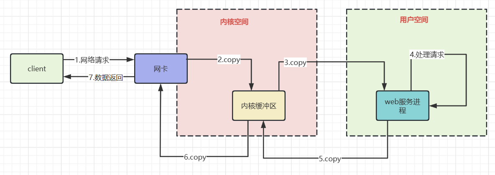
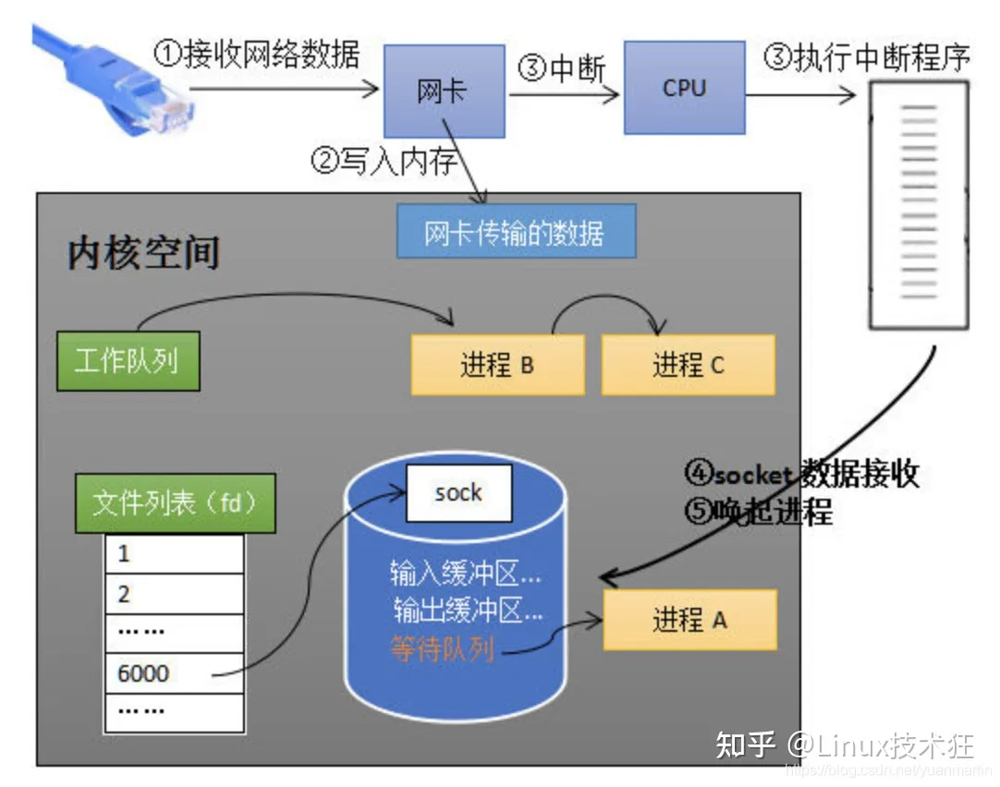

# ddd
## 1. 建立连接

[视屏](https://www.mashibing.com/course/340)

### 1.1. [TCP三次握手.md](detail/TCP%E4%B8%89%E6%AC%A1%E6%8F%A1%E6%89%8B.md)

### 1.2. [socket创建](detail/socket%E5%88%9B%E5%BB%BA.md)

## 2. 内核接收读取socket中的数据

### 2.1 [BIO.md](detail/BIO.md) java方面基于Stream

自选餐线，我们点餐的时候都得在队伍里排队等待，必须等待前面的同学打好菜才到我们，这就是同步阻塞模型BIO。

### 2.2 [NIO.md](detail/NIO/NIO.md)  java 方面基于Channel Buffer

麻辣烫餐线，会给我们发个叫号器，我们拿到叫号器后不需排队原地等待，我们可以找个地方去做其他事情，等麻辣烫准备好，我们收到呼叫之后，自行取餐，这就是同步非阻塞。

好处：可以一个线程管理多个 channel来进行io   在io并发密集时 传统的只能开很多线程去接受，nio 可以 省线程，从而节省线程切换时间

### 2.3 [AIO.md](detail/AIO.md)(Asynchronous -io) 

包厢模式，我们只要点好菜，坐在包厢可以自己玩，等到饭做好，服务员亲自送，无需自己取，这就是异步非阻塞I/O模型AIO。

