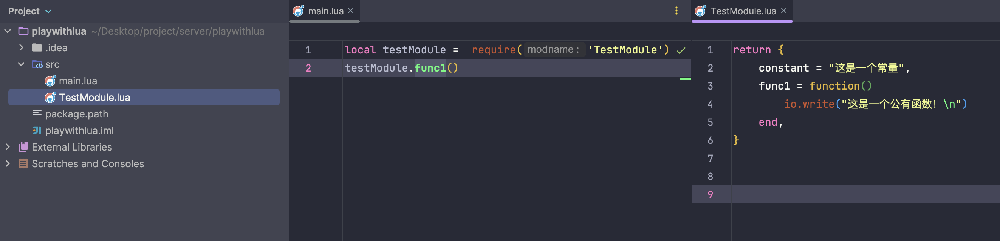

# 模块
[Lua 模块与包 | 菜鸟教程 (runoob.com)](https://www.runoob.com/lua/lua-modules-packages.html)

## 编写模块

```lua

module = {}  
   
-- 定义一个常量  
module.constant = "这是一个常量"  
   
-- 定义一个函数  
function module.func1()  
    io.write("这是一个公有函数！\n")  
end  
   
local function func2()  
    print("这是一个私有函数！")  
end  
   
function module.func3()  
    func2()  
end  
   
return module


=============


return {  
    constant = "这是一个常量",  
    func1 = function()  
        io.write("这是一个公有函数！\n")  
    end,  
}


```

## 引入并使用

```lua

require("module")  
print(module.constant)  
module.func1()

local m = require("module")  
print(m.constant)  
m.func1()


```

