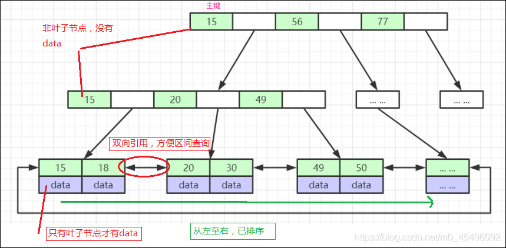
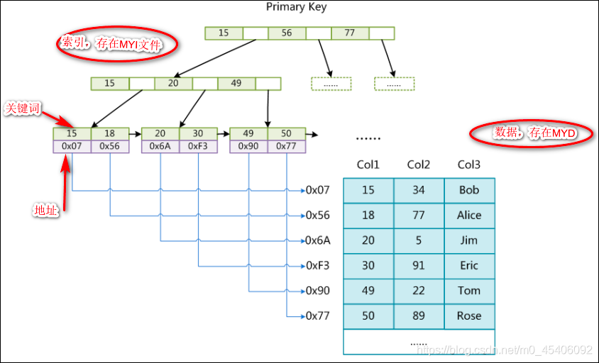

聚簇索引的叶子节点就是数据节点，也就是说索引和数据行在一起；反之，如果叶子节点没有存储数据行，那么就是非聚簇索引。

在mysql数据库中，myisam引擎和innodb引擎使用的索引类型不同，

`myisam对应的是非聚簇索引`，而`innodb对应的是聚簇索引`。

 二级索引，又称作辅助索引，均属于非聚簇索引

## 聚簇索引

聚簇索引的叶子节点就是数据节点，也就是说索引和数据行在一起。

那么采用聚簇索引架构的innodb来说，他的叶子节点和数据行就是在一起的。我们来看下innodb B+树的实现：

一个表只能有一个聚簇索引。

_我们知道聚簇索引中包含了数据行，那么如果有多个聚簇索引，就说明存储了多份相同的数据行，岂不浪费空间？_

联想innodb的存储文件，在一个数据table中，它的数据文件和索引文件是同一个文件。即在查询过程中，找到了索引，便找到了数据文件。这也间接说明innodb采用的是聚簇索引。

聚簇索引默认由主键实现(用主键作为B+树的key，并且把数据行绑定在叶子节点)。

如果表中没有定义主键A，InnoDB 会选择一个唯一且非空的列B代替(主键A的特性就是唯一且非空，如果把主键A比作嫡长子，那么列B就是其他儿子，只是继承的顺序靠后，但毕竟也是有皇家血脉的，没有嫡长子，就拿其他儿子当继承人了)。

如果没有这样的列B，InnoDB 会隐式定义一个主键（类似oracle中的RowId）来作为聚簇索引。

<mark>如果已经设置了主键为聚簇索引又希望再单独设置聚簇索引，必须先删除主键，然后添加我们想要的聚簇索引，最后恢复设置主键即可. </mark>

## 非聚簇索引

<mark>myisam采用非聚簇索引实现</mark>

在myisam中，一个数据表table的存储文件，它是由`table.frm、table.myd以及table.myi`组成。table.myd记录了数据（数据行），table.myi记录了索引的数据。

myisam引擎的索引文件和数据文件是独立分开的，正好符合非聚簇索引的架构。

> MyISM使用的是非聚簇索引，非聚簇索引和InnoDB的聚簇索引这两棵B+树看上去没什么不同，节点的结构完全一致，只是存储的内容不同而已，InnoDB主键聚簇索引B+树的节点存储了主键和数据行，MyISM非聚簇索引B+树存储了主键和指向data的指针。

## 二级索引
二级索引，又被称为辅助索引(组合索引)，在不同存储引擎中的内容不同。

InnoDB中的二级索引存放的是主键值，如果需要查询对应的数据行，需要回表查询，即在聚簇索引中进一步查找对应的数据行。这样可以避免在行移动或者插入新数据时出现的页分裂问题。

MyISAM中无论是主键索引还是二级索引，索引的叶子节点存放的都是指向数据行的指针，保证可以通过索引进而查找到对应的数据行，只需要对索引进行一遍查找。这样会存在页分裂问题。

